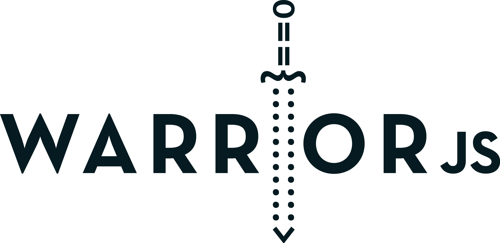
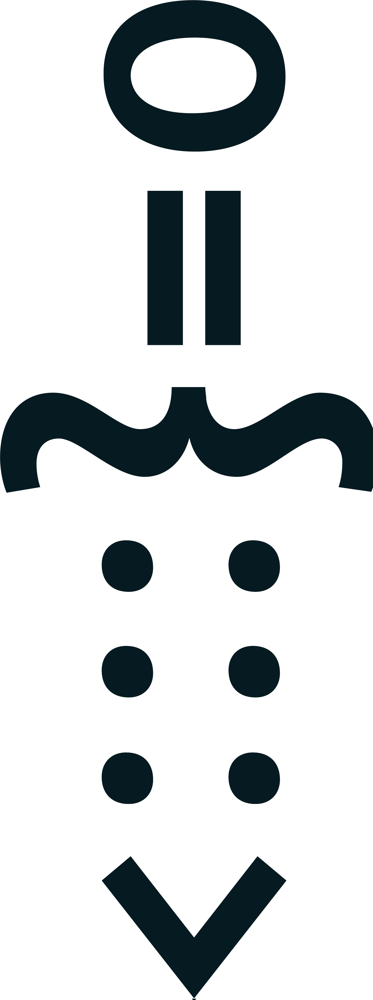

# The WarriorJS logo

The WarriorJS logo was designed with the origins of the WarriorJS project in mind— 
[WarriorJS](https://github.com/olistic/warriorjs) is played from the Terminal, so doing something mixing ASCII art and high-color contrast made a lot of sense.

These are the original WarriorJS logos. Don't use any other logo to represent WarriorJS.

## Flavors

The logo comes in two flavors, each in a dark and light version.

The horizontal lockup should be your first choice whenever possible. 
When the space is limited, there is a small version a.k.a. *The WarriorJS Sword*.

### Horizontal lockup

Download:

[PNG dark](logo-dark.png) | [PNG light](logo-light.png) | [SVG](logo.svg)

### Small lockup

*The WarriorJS Sword*

Download:

[PNG dark](logo-small-dark.png) | [PNG light](logo-small-light.png) | [SVG](logo-small.svg)

## Spacing

To ensure the logo stands on its own, please leave at least one *x*'s worth of space around it.

## Colors

The WarriorJS color palette is mostly neutral, but should not be considered *“shades of grey”* (much less *"fifty shades of grey"*).

Dark color: `#1b2936`

Light color: `#f8f8f8`

## Typeface

[Neutra Text Bold](http://fontsgeek.com/fonts/Neutra-Text-Bold-Alt)

## Credits

The WarriorJS logo was designed by [Guillermo Cura](http://guillecura.co/).

## License

The WarriorJS logo is licensed under CC0, waiving all copyright. [Read license](LICENSE.md).
